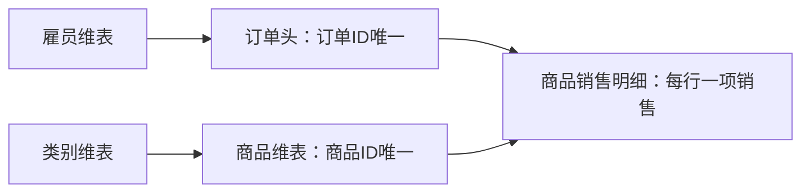

# B12 模型与指标

```mermaid
flowchart LR
    E[雇员维表] --> O[订单头：订单ID唯一]
    O --> D[商品销售明细：每行一项销售]
    C[类别维表] --> P[商品维表：商品ID唯一]
    P --> D
```

箭头表示关联路径。Python合并时验证维表唯一键和必需外键，保留缺失雇员标签。金额来自明细，订单数来自当前明细中订单ID的去重数。源数据没有数量列，不编造销量、客件数或单价分解。

利润为销售金额减销售成本，利润率为总利润除以总销售金额。税费、退款、营销成本不在源字段中，不推断净利润。
