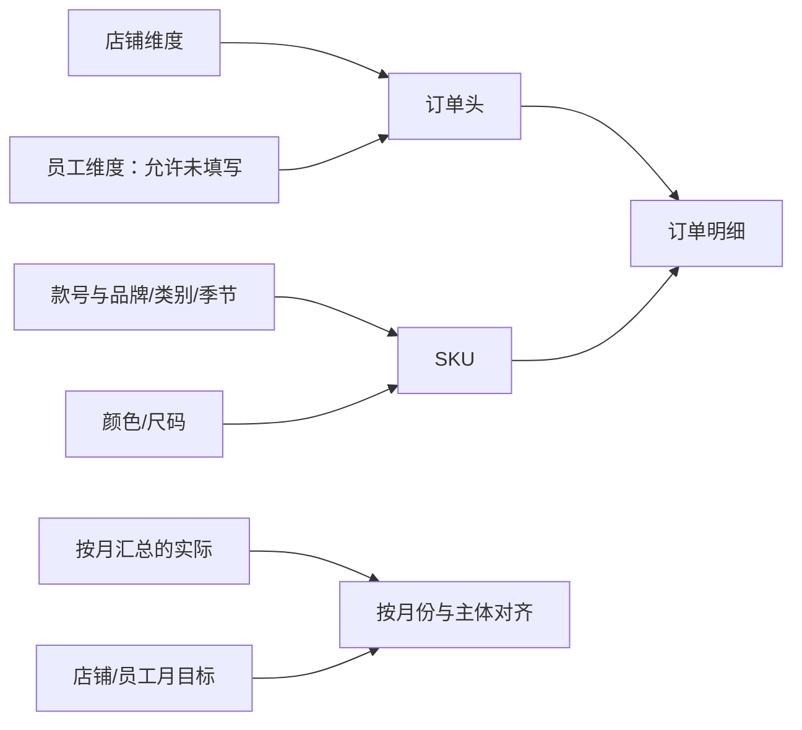

# B13 模型与计算说明

```mermaid
flowchart LR
    O[订单头] --> D[订单明细]
    S[店铺维度] --> O
    E[员工维度：允许未填写] --> O
    P[SKU] --> D
    T[款号与品牌/类别/季节] --> P
    C[颜色/尺码] --> P
    A[按月汇总的实际] --> R[按月份与主体对齐]
    G[店铺/员工月目标] --> R
```

订单金额在明细聚合后逐单与头表核对。订单头只提供维度，不把头表金额重复到每个商品上。月目标与交易事实保持独立粒度，按月/主体汇总后关联；缺目标不填0。

折扣率、客单价、件单价、连带率均从各自分子分母合计重算，不平均逐行比率。订单数、会员数跨商品类别不能直接相加。会员同期群使用首次观察购买月份，不能推断观察窗口之前的消费历史。
